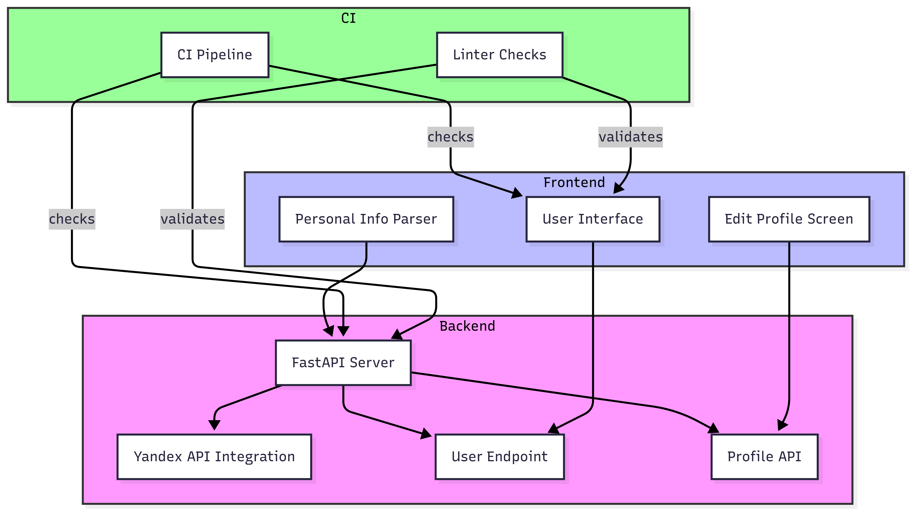

[](https://gitlab.pg.innopolis.university/d.chegaev/shareyourride/pipelines)

[](https://gitlab.pg.innopolis.university/d.chegaev/shareyourride/-/issues)
[](https://opensource.org/licenses/MIT)

<a id="readme-top"></a>

# HamSafar - Ride-Sharing App for Central Asia


**HamSafar** is a mobile app that enables convenient and reliable intercity ride-sharing across Central Asia.

<!-- TABLE OF CONTENTS -->
<details>
  <summary>Table of Contents</summary>
  <ol>
    <li>
      <a href="#about-the-project">About The Project</a>
      <ul>
        <li><a href="#built-with">Built With</a></li>
        <li><a href="#features">Features</a></li>
      </ul>
    </li>
    <li><a href="#how-to-run">How to Run</a>
    </li>
    <li><a href="#development">Development</a></li>
    <ul>
        <li><a href="#kanban-board">Kanban Board</a></li>
        <li><a href="#git-workflow">Git workflow</a></li>
        <li><a href="#secrets-management">Secrets management</a></li>
        <li><a href="#automated-tests">Automated tests</a></li>
        <li><a href="#continuous-integration">Continuous Integration</a></li>
    </ul>
    <li><a href="#quality">Quality</a></li>
    <li><a href="#architecture">Architecture</a>
    <li><a href="#authors">Authors</a></li>
    <li><a href="#license">License</a>
  </ol>
</details>

## About The Project

### Built With

* [![Python][Python.org]][Python-url]
* [![FastAPI][FastAPI.com]][FastAPI-url]
* [![Flutter][Flutter.dev]][Flutter-url]
* [![Dart][Dart.dev]][Dart-url]
* [![MongoDB][MongoDB.com]][MongoDB-url]
* [![Docker][Docker.com]][Docker-url]
* [![Ubuntu][Ubuntu.com]][Ubuntu-url]
* [![Telegram][Telegram.com]][Telegram-url]
* [![Yandex Maps][Yandex.com]][Yandex-url]

### Features
-  **User-friendly ride matching** - Quickly find available rides or passengers nearby.
-  **Multi-language support** - Available in Tajik and English to serve Central Asian users.
-  **Cost-efficient travel** - Share ride costs to save money.
-  **Real-time notifications** - Receive alerts about trip status and updates.
-  **Cross-platform mobile app** - Built with Flutter for smooth performance on Android and iOS.
-  **Fast and reliable backend** - Powered by FastAPI for quick responses and scalability.

<p align="right">(<a href="#readme-top">back to top</a>)</p>

## How to Run

1. [Install Flutter](https://docs.flutter.dev/get-started/install?_gl=1*jjmxmh*_ga*MTYwNjk4MTAxNi4xNzQ5MTM4NTk3*_ga_04YGWK0175*czE3NDk4MDA0NTYkbzYkZzEkdDE3NDk4MDA0ODEkajM1JGwwJGgw) for your development platform
2. Run `flutter doctor` in your terminal until requirements are satisfied
3. Clone the repository
4. Configure virtual python environment in `/backend` folder and install `requirements.txt`
5. Start api server from `/backend` with the command `fastapi dev(or run) api/application.py`
6. Execute `flutter --no-color pub get` from the `/frontend` directory
7. Run **/lib/main.dart** to start the application

<p align="right">(<a href="#readme-top">back to top</a>)</p>

## Development

### [Kanban board]((https://gitlab.pg.innopolis.university/d.chegaev/shareyourride/-/boards))


- **Backlog** - tasks not yet taken into work.
- **To Do** - tasks ready to be worked on.
- **In Progress** - tasks currently being worked on.
- **Done** - completed and tested tasks.

### Git workflow

- `main` - production-ready branch, contains stable and reviewed code.
- `feature/parse-pers-inf` - used for implementing a personal info parser.
- `destructive_backend_injection` - task-specific branch, e.g., for backend experiments or testing.


Rules:

- **Creating Issues:** from predefined templates (see [.gitlab/issue_templates](./.gitlab/issue_templates)).
- **Labelling:** used to define type and priority (e.g., `feature`, `bug`, `P1`).
- **Assigning:** issues are assigned to responsible developers.
- **Branches:** created from `main` with clear, task-specific names (e.g., `destructive_backend_injection`, `feature/parse-pers-inf`).

- **Commit messages:** written in imperative mood, e.g., `Add ride search feature`.
- **Merge Requests:** always linked to an issue, follow our MR template.
- **Code Reviews:** require approval from at least 1 teammate.
- **Merging:** done via squash merge after CI passes and review is complete.
- **Closing Issues:** issues are manually marked as closed by team members in GitLab once the related work is done.

*Git workflow visualization* 


### Secrets management

- All secrets (API keys, etc.) are stored in `project_settings.yaml` file and not committed to the repository.

### Automated tests

- We have implemented **unit tests** and **integration tests**.
- **Backend tests** are located in `/backend/test/integration_tests/`.
- **Frontend unit tests** are located in `/frontend/test/unit_tests/`.
- Testing tools and frameworks are not yet finalized.

### Continuous Integration

- CI workflow file: [.gitlab-ci.yml](https://gitlab.pg.innopolis.university/d.chegaev/shareyourride/-/blob/main/.gitlab-ci.yml?ref_type=heads)
- In CI we use:
  - `pycodestyle` � for Python static code analysis.
  - `pytest` � to run backend tests.
  - `flutter test` � to run frontend tests.
- All CI runs can be viewed [here](https://gitlab.pg.innopolis.university/d.chegaev/shareyourride/-/pipelines).

<p align="right">(<a href="#readme-top">back to top</a>)</p>

## Quality

### Functional Suitability

#### Functional Appropriateness

**Why it matters:**  
The user interface should only provide relevant, concise, and context-specific features that support users in achieving their goals efficiently. For the Add Ride flow, this means users must be able to input the necessary data easily and without confusion. Including clear field labels and grouping related inputs improves task effectiveness.

**Test Scenario:**
> **GIVEN** a driver is adding a new ride,  
> **WHEN** they enter the required data (departure city, arrival city, date, number of passengers),  
> **THEN** the screen accepts input and is ready for form submission without unnecessary complexity.

**Test Implementation:**  
We validate this via a Flutter widget test:

```dart
testWidgets('AddRideScreen render and submit form', (
WidgetTester tester,
) async {
await tester.pumpWidget(
MaterialApp(home: Material(child: AddRideScreen())),
);

expect(find.text('General'), findsOneWidget);
expect(find.text('Ride details'), findsOneWidget);
expect(find.text('Car information'), findsOneWidget);

await tester.enterText(find.byKey(Key('departureCityField')), 'Moscow');
await tester.enterText(find.byKey(Key('arrivalCityField')), 'Innopolis');
await tester.enterText(find.byKey(Key('dateField')), "28/06/2025");
await tester.enterText(find.byKey(Key('passengersField')), "3");
});
```
[Link to the test](https://gitlab.pg.innopolis.university/d.chegaev/shareyourride/-/blob/cb5260928c924e67ca61955eecbfc27f36060316/frontend/test/unit_tests/add_ride_screen_unit_test.dart)

#### Functional Correctness

**Why it matters:**  
The app must preserve and use the exact input values provided by users to search for rides. If there is a mismatch between what the user enters and what the app stores or processes, the search results will be invalid, causing confusion or even failed bookings.

**Test Scenario:**
> **GIVEN** a passenger enters origin, destination, date, and passenger count,  
> **WHEN** a `DataSearch` object is initialized,  
> **THEN** all parameters must be correctly stored without loss or mutation.

**Test Implementation:**  
This behavior is tested using a simple Dart unit test:

```dart
test('DataSearch should correctly initialize with parameter', () {
final dataSearch = DataSearch('Paris', 'London', '01/01/2023', '2');

expect(dataSearch.from, 'Paris');
expect(dataSearch.to, 'London');
expect(dataSearch.date, '01/01/2023');
expect(dataSearch.passengers, '2');
});
```
[Link to the test](https://gitlab.pg.innopolis.university/d.chegaev/shareyourride/-/blob/ed2338a45b1d6f19b987a032ae1a0f0ab7117174/frontend/test/unit_tests/data_search_model_non_empty_unit_test.dart)

### Maintainability

#### Modifiability

**Why it matters:**  
In a multi-environment project, the system must allow configuration changes (like API host) without code duplication or risk of bugs. Centralized and easily testable settings are essential for safe deployments and easier debugging.

**Test Scenario:**
> **GIVEN** a backend developer starts the app in the local environment,  
> **WHEN** they access `settings_manager.api.host`,  
> **THEN** it must return the correct base URL `http://127.0.0.1`, ensuring safe configuration handling.

**Test Implementation:**  
We verify this via a Python unit test:

```python
import unittest
from settings_manager import settings_manager


class TestHostObtaining(unittest.TestCase):
    def test_obtain(self):
        self.assertEqual(settings_manager.api.host, "http://127.0.0.1")


if __name__ == "__main__":
    unittest.main()
```
[Link to the test](https://gitlab.pg.innopolis.university/d.chegaev/shareyourride/-/blob/8375f95509d5cebe48cda369b2f7160c045cd7cd/backend/test/integration_tests/settings_manager_host_integration.py)

<p align="right">(<a href="#readme-top">back to top</a>)</p>

## Architecture

### Static view

Currently, the system has the following modules:
- **Flutter app** (Dart) running on mobile devices (Android/iOS)
- **Backend API**, implemented in your chosen server technology
- **MongoDB** database

[Link to the diagram](https://gitlab.pg.innopolis.university/d.chegaev/shareyourride/-/blob/main/docs/architecture/static-view/Component%20Diagram.png)

---

### Dynamic view

Example flow: **user creates & confirms a ride**
1. Flutter app sends request to FastAPI backend.
2. Backend validates data and writes to MongoDB.
3. A confirmation message is sent via external service.
4. Upon confirmation, backend updates ride status in DB.
5. Optional notification sent to driver/passenger.

[Link to the diagram](https://gitlab.pg.innopolis.university/d.chegaev/shareyourride/-/blob/main/docs/architecture/dynamic-view/Sequence%20Diagram.png)

---

### Deployment view

Current state:
- Flutter app is distributed via Google Play / App Store.
- FastAPI backend is deployed manually.
- MongoDB runs separately.

[Link to the diagram](https://gitlab.pg.innopolis.university/d.chegaev/shareyourride/-/blob/main/docs/architecture/deployment-view/Deployment%20diagram.png)

Improvement areas:
- Unify containers with Docker Compose
- Separate concerns in backend (routes, logic, DB)
- Automate deployment (CI)

<p align="right">(<a href="#readme-top">back to top</a>)</p>

## Authors
[Arsen Latipov](https://gitlab.pg.innopolis.university/a.latipov) | [Danil Chegaev](https://gitlab.pg.innopolis.university/d.chegaev) | [Karina Krotova](https://gitlab.pg.innopolis.university/k.krotova) | [Sofia Seliutina](https://gitlab.pg.innopolis.university/s.seliutina) | [Varvara Gubanova](https://gitlab.pg.innopolis.university/va.gubanova) | [Anna Morozova](https://gitlab.pg.innopolis.university/an.morozova)

<p align="right">(<a href="#readme-top">back to top</a>)</p>

## License
This project is licensed under the [MIT License](https://gitlab.pg.innopolis.university/d.chegaev/shareyourride/-/blob/main/LICENSE?ref_type=heads).

<p align="right">(<a href="#readme-top">back to top</a>)</p>

<!-- MARKDOWN LINKS & IMAGES -->

[Python.org]: https://img.shields.io/badge/Python-3776AB?style=for-the-badge&logo=python&logoColor=white
[Python-url]: https://www.python.org/

[FastAPI.com]: https://img.shields.io/badge/FastAPI-009688?style=for-the-badge&logo=fastapi&logoColor=white
[FastAPI-url]: https://fastapi.tiangolo.com/

[Flutter.dev]: https://img.shields.io/badge/Flutter-02569B?style=for-the-badge&logo=flutter&logoColor=white
[Flutter-url]: https://flutter.dev/

[Dart.dev]: https://img.shields.io/badge/Dart-0175C2?style=for-the-badge&logo=dart&logoColor=white
[Dart-url]: https://dart.dev/

[MongoDB.com]: https://img.shields.io/badge/MongoDB-47A248?style=for-the-badge&logo=mongodb&logoColor=white
[MongoDB-url]: https://www.mongodb.com/

[Docker.com]: https://img.shields.io/badge/Docker-2496ED?style=for-the-badge&logo=docker&logoColor=white
[Docker-url]: https://www.docker.com/

[Ubuntu.com]: https://img.shields.io/badge/Ubuntu-E95420?style=for-the-badge&logo=ubuntu&logoColor=white
[Ubuntu-url]: https://ubuntu.com/

[Telegram.com]: https://img.shields.io/badge/Telegram-26A5E4?style=for-the-badge&logo=telegram&logoColor=white
[Telegram-url]: https://core.telegram.org/bots

[Yandex.com]: https://img.shields.io/badge/Yandex.Maps-FF0000?style=for-the-badge&logo=yandex&logoColor=white
[Yandex-url]: https://yandex.com/dev/maps/